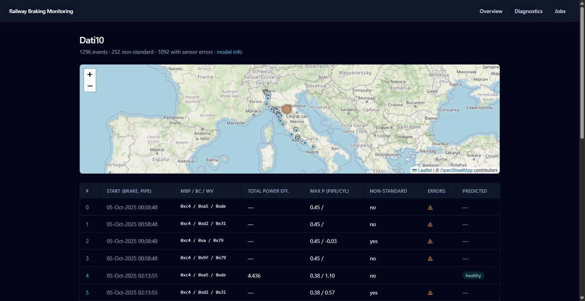
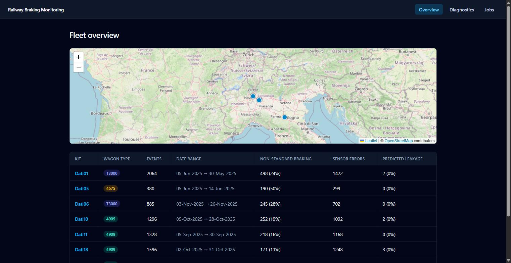
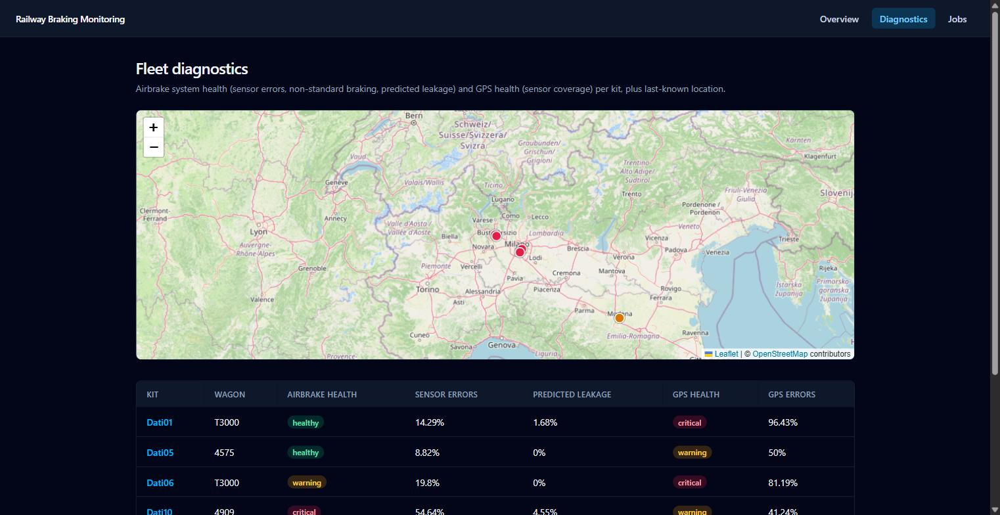
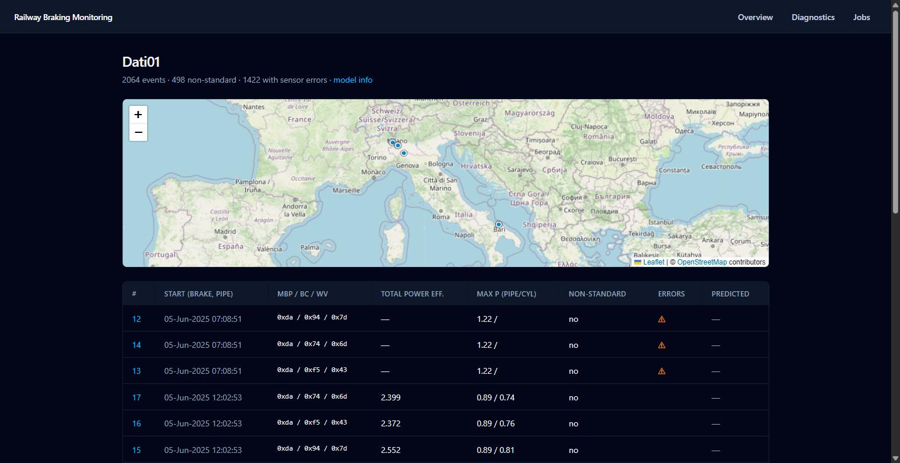
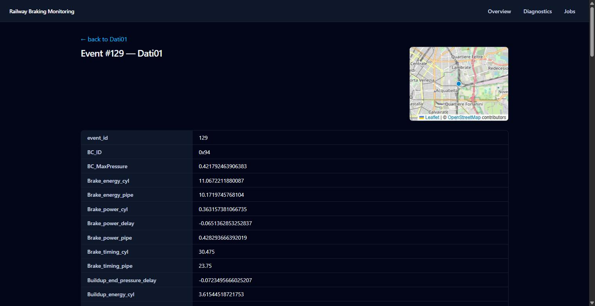
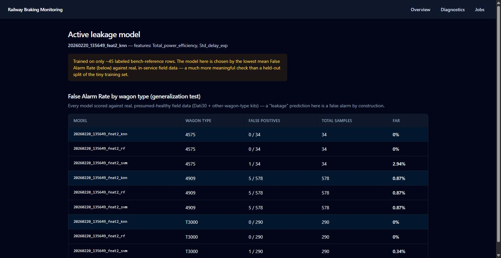

# Railway Braking Monitoring Dashboard

A full-stack monitoring dashboard for railway airbrake health and GPS diagnostics, built on top of a MATLAB → Python telemetry pipeline that ingests raw pressure/GPS sensor data, derives braking-cycle features (MBP/BC/WV), and scores them with a trained leakage-detection classifier.

**Stack:** FastAPI · React + Vite + Tailwind · Leaflet · scikit-learn · MATLAB/Python signal-processing pipeline

## Screenshots

Clicking a map marker drills straight into that kit's route-coverage map, then into the individual event's exact location and full feature breakdown:



| Fleet overview — map + per-kit health | Fault & GPS diagnostics |
|---|---|
|  |  |

| Kit detail — route coverage map | Event detail — mini-map + full feature table |
|---|---|
|  |  |

| Model page — False Alarm Rate by wagon type |
|---|
|  |

Clicking any map marker drills down: fleet map → kit's route coverage → individual event's exact location and full sensor/derived-feature breakdown.

## What it does

- **Fleet overview**: every kit at a glance — event counts, non-standard braking rate, sensor error rate, predicted leakage rate, wagon type, and a map of last-known locations.
- **Fault + GPS diagnostics**: per-kit health status (healthy/warning/critical) for both the airbrake system and GPS coverage, computed over the same quality-filtered regime the model was validated against — not raw, unfiltered rates (see [Engineering notes](#engineering-notes) for why that distinction mattered).
- **Leakage model**: picks the best of several trained models (KNN/RF/SVM) by the lowest mean False Alarm Rate against real, presumed-healthy field data across every wagon type — not a held-out split of the ~45-row training set, which would be far too small to trust.
- **Pipeline jobs**: trigger the Stage 1 (raw `.bin` ingestion) + Stage 2 (feature extraction) pipeline against new raw telemetry directly from the UI, with live progress polling.

## Try it — runs on sample data out of the box

```bash
git clone https://github.com/bwpras/mythesis.git
cd mythesis

# 1) put the sample data where the backend expects it
mkdir -p data/processed outputs/models/finished_thesis
cp sample_data/processed/*.csv data/processed/
cp sample_data/models/finished_thesis/* outputs/models/finished_thesis/

# 2) backend — terminal 1, http://localhost:8000
cd backend && pip install -r requirements.txt
python -m uvicorn app.main:app --port 8000

# 3) frontend — terminal 2, http://localhost:5173
cd frontend && npm install && npm run dev
```

Open `http://localhost:5173`. Requires Python 3.10+ and Node.js 18+.

`data/` and `outputs/` (where the dashboard normally reads real processed data and trained models from) aren't tracked in this repo — they're large, and in this project's case, real operational telemetry. `sample_data/` ships instead: the real feature CSVs and the real trained model, with only GPS coordinates shifted by one fixed random offset (map still shows a realistic, internally consistent route per kit — just not the real one). Every other field — pressures, timings, sensor flags, predictions — is unmodified real data. See `sample_data/README.md` for exactly what changed.

## Deploy a live demo (free)

The repo ships `render.yaml` and `vercel.json` for a free two-service deploy: **Render** (free web service) for the FastAPI backend, **Vercel** (free static hosting) for the React frontend. The backend's build step seeds `data/` and `outputs/` from `sample_data/`, same as the local instructions above — a public deploy this way always shows the anonymized sample dataset, never real telemetry.

1. **Backend — Render**: [New +] → **Blueprint** → pick this repo. Render reads `render.yaml` and creates a free web service (`mythesis-backend`) that installs `backend/requirements.txt`, copies `sample_data/` into place, and runs uvicorn. Once deployed, note its URL (e.g. `https://mythesis-backend.onrender.com`).
2. **Frontend — Vercel**: [Add New...] → **Project** → import this repo. This is a monorepo, so on the import screen set **Root Directory** to `frontend` (click Edit next to it) — Vercel then auto-detects Vite and uses its own default build command/output directory relative to that folder; `vercel.json`'s `"framework": "vite"` is just a hint, it deliberately does **not** set a custom build command, since one written against the repo root would break once Root Directory is set to `frontend` (and vice versa). Before deploying, add an environment variable:
   - `VITE_API_BASE_URL` = `https://mythesis-backend.onrender.com/api` (your Render URL + `/api`)
3. **Lock down CORS**: back in the Render service's environment variables, set `ALLOWED_ORIGINS` to your Vercel URL (e.g. `https://mythesis.vercel.app`, no trailing slash) and let it redeploy.

Notes:
- Render's free plan spins the backend down after 15 minutes idle; the first request after that takes ~30-50s to wake it back up, then responds normally.
- The Jobs page's pipeline runs and live-watch features write to the backend's local disk, which is ephemeral on Render free — fine for demoing, but state resets on redeploy/restart.
- Prefer a single always-on URL, or don't want two accounts? `render.yaml`'s build/start commands also work as a plain Render **Web Service** (skip Vercel) if you additionally serve `frontend/dist` from FastAPI — not wired up by default here.

### Using your own data instead

Replace what you copied from `sample_data/` above:

- `data/processed/TestBrakefinal_data_raw_<DatiXX>.csv` — Stage 2 output for each kit (see `python_port/README.md`; the Jobs page in the dashboard itself can run Stage 1+2 against raw telemetry under `data/raw/<DatiXX>/`).
- `outputs/models/finished_thesis/*_inference.joblib` — a trained model bundle, as produced by `python/scripts/train_binary_classifier.py`'s `save_model_artifacts()` (dict with `pipeline` and `features` keys). The dashboard picks whichever bundle has the lowest mean False Alarm Rate against the kits listed in `backend/app/services/wagon_type.py`'s `GENERALIZATION_TEST_KITS` — adjust that mapping to match your own fleet/kit naming.

## Engineering notes

A few things worth knowing if you're reading the code:

- **The Python port is independently validated against real MATLAB output**, not just assumed correct — see `python_port/README.md` for the tolerance-based comparison methodology, and `python_port/tools/compare_stage2_output.py` for the actual diff tool.
- **Raw sensor-error and GPS-error rates are misleading on this data** — Stage 2 emits one row per phase per *candidate* BC/WV sensor pairing (2-3 candidates per real event), and only one candidate is ever the true pairing; the others structurally show sensor errors by construction. Every rate shown in the dashboard is computed over the same quality-filtered regime (`WV_bin==1`, clean braking) the model itself was validated against, not the raw per-row rate — which would show 65-97% "errors" on every kit regardless of actual health.
- **GPS `(0,0)`-ish values are a hardware cold-start sentinel, not a location** — filtered out everywhere (`data_store.valid_gps_fix()`), or an early version of the per-kit map would auto-zoom out to include a marker in the Gulf of Guinea.
- **Model selection is data-driven**, mirroring the original validation notebook: every candidate model is scored against real, presumed-healthy field data across every wagon type, and the one with the lowest mean False Alarm Rate is used — not an arbitrary pick.

## Underlying pipeline

The dashboard sits on top of a MATLAB → Python telemetry pipeline:

1. In MATLAB, run `startup` from `matlab/main`, then `batchprocess` to decode raw telemetry into `Nodo` structures, then `Algorithm_main_batch` for feature extraction — **or** use `python_port/`, an independently-validated Python port of the same two stages (recommended; see its README for why).
2. Feed the resulting feature CSVs to `python/scripts/train_binary_classifier.py` (or `train_multiclass_classifier.py`) to train a leakage classifier.
3. Point the dashboard at the resulting CSVs + trained model (see [Try it](#try-it--runs-on-sample-data-out-of-the-box) above).

## Layout

- `matlab/`: selected active MATLAB ingestion, feature extraction, analysis, visualization, and apps.
- `python/`: active training scripts, package helpers, and organized notebooks.
- `python_port/`: Python port of the MATLAB ingestion + feature-extraction pipeline (Stage 1 + Stage 2), independently validated against real MATLAB-produced output — see `python_port/README.md`.
- `backend/` + `frontend/`: the monitoring dashboard (FastAPI + React), see above.
- `sample_data/`: small, anonymized demo dataset — see above.
- `data/`: documented data locations. Large raw collections remain preserved at the workspace root; not tracked in this repo (see `data/README.md`).
- `outputs/`: generated figures, models, predictions, reports, and feature exports; not tracked in this repo.
- `archive/`: historical and duplicate implementations, never added by `startup`.
- `docs/`: workflow, dependency, inventory, and restructuring documentation.

See `PROJECT_STRUCTURE.md`, `docs/matlab_pipeline.md`, `docs/python_pipeline.md`, and `docs/unresolved_issues.md` before running the MATLAB/Python pipeline directly.
